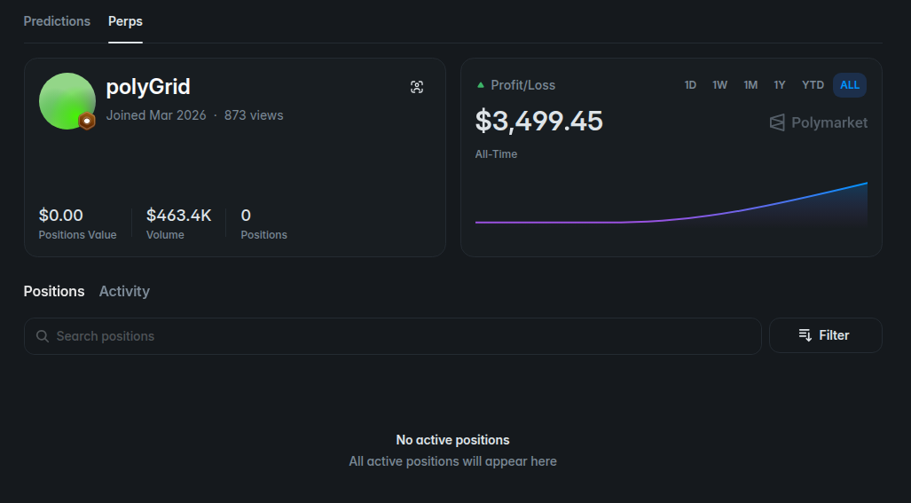
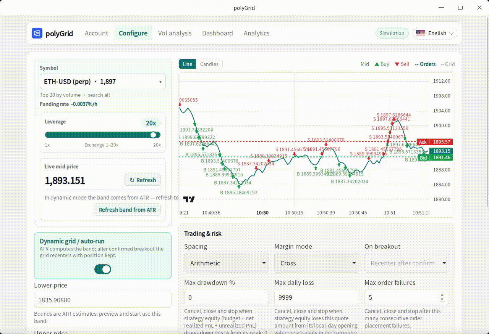

# polyGrid

**English** | [中文](./README.zh-CN.md)

> A local desktop app for grid trading on [Polymarket Perps](https://polymarket.com/zh/perps?c=00kzjwdi) perpetual futures. The UI supports **中文, English, 日本語, 한국어, Español, Français, Deutsch, Português, and Русский** — auto-detected from the system locale, or switch anytime from the top-right language picker.

Set a price range and size. The app places buys below the market and sells above it — aiming to profit when price oscillates inside that range.

- **Author Telegram:** [https://t.me/smith123_lee](https://t.me/smith123_lee) — if you like the app, feel free to ask about the Pro edition  

Live account example:



## Demo

<p align="center">
  
</p>

> This app can connect to real markets with real funds. Understand the risks first. Prefer **Simulation** or **Testnet** before going live.

## How it works

Grid trading splits a price band into multiple levels. Roughly:

1. **Define the range** — set lower/upper price, grid count, and total size; or fill ±5% around mid.
2. **Place the grid** — relative to the live mid: **buys** below, **sells** above.
3. **Refill on fill** — a buy fill places a sell higher; a sell fill places a buy lower, harvesting swings inside the band.
4. **Risk & stop** — optional breakout actions, max drawdown, daily loss limits; **Stop** cancels all orders and flattens positions at market.

The app does **not** deposit or withdraw for you. Polymarket has separate **prediction-market** and **perps** balances — this app only uses the perps side, so funding the prediction-market wallet will not work for grids. Perps currently requires an invite — activate via [this link](https://polymarket.com/zh/perps?c=00kzjwdi), then deposit **pUSD** into your **perps account**.

## Quick start

### Download portable build (recommended)

If you do not want to compile, download a prebuilt app from **[Releases](../../releases)**:

1. Pick the file for your OS (no installer):
   - **Windows** → `polyGrid-windows-x64.exe` (double-click)
   - **macOS Apple Silicon** → `polyGrid-macos-arm64.app.tar.gz` (extract, open the `.app`)
   - **macOS Intel** → `polyGrid-macos-x64.app.tar.gz` (extract, open the `.app`)
   - **Linux** → `polyGrid-linux-x86_64.AppImage`, then:
     ```bash
     chmod +x polyGrid-linux-x86_64.AppImage
     ./polyGrid-linux-x86_64.AppImage
     ```
2. Open the app and try **Simulation** first.
3. Use the top-right language picker (nine languages; defaults to your system locale).

**Linux note:** The AppImage is built on Ubuntu 22.04 (needs a recent glibc). Ubuntu **20.04** cannot run the desktop build.

### Run from source

Install [Rust](https://rustup.rs) and [Node.js](https://nodejs.org/) (20+ recommended).

```bash
cd apps/desktop
npm install
npm exec tauri dev    # launch the desktop app
```

On Linux you also need WebKit and related system packages (e.g. `libwebkit2gtk-4.1-dev`), or the desktop build will fail.

## Before live trading

| Item | Notes |
|------|------|
| Polymarket Perps (pUSD) | Invite required: [activate here](https://polymarket.com/zh/perps?c=00kzjwdi). Prediction-market and perps wallets are separate — fund **pUSD into the perps account** (prediction-market deposits do not count). |
| Wallet private key | MetaMask-style wallet keys and keys exported after email / Google login via [reveal.magic.link/polymarket](https://reveal.magic.link/polymarket) both work; stored only in the local `.env`. Simulation can skip it. |

Mainnet requires a private key before start.

## Three steps

1. **Account** — pick Simulation / Testnet / Mainnet; for live modes paste the key and **Refresh balances**.
2. **Configure grid** — symbol, range, levels, size, leverage → **Preview** → **Start**.
3. **Run panel** — watch status, PnL, and fills; **Pause / Resume / Stop** as needed (Stop cancels and flattens).

You can also set spacing (arithmetic / geometric), margin mode (cross / isolated), fixed / dynamic grid, breakout behavior, max drawdown, and daily loss; import / export strategy configs is supported. The PnL analytics tab shows all-session totals and equity curves.

## Common settings

| Setting | Notes |
|------|------|
| Run mode | **Simulation** (no real funds) / **Testnet** / **Mainnet** |
| Symbol | Polymarket Perps (e.g. BTC); not spot grids |
| Lower / upper price | Grid band; in dynamic mode filled from ATR (refreshable) |
| Fit range from mid % | Quick ±N% band around live mid (`RANGE_PCT`) |
| Grid levels | Number of layers in the band (start with defaults) |
| Total notional | Planned notional in pUSD; too little per level blocks start (min ~$1/level) |
| Spacing | Arithmetic / geometric |
| Margin mode | Cross / isolated |
| Leverage | Amplifies both gain and loss |
| Grid mode | **Dynamic** (default): ATR band, optional soft recenter with position kept; **Fixed**: manual bounds (`GRID_MODE`) |
| ATR candle interval | Candle interval for ATR, default `1h` (`ATR_INTERVAL`) |
| ATR period | ATR lookback bars, default 14 (`ATR_PERIOD`) |
| ATR multiplier | Half-width ≈ ATR% × mult, default `5`, clamped ~2%–12% (`ATR_MULT`) |
| Breakout confirm bars | Closed candles outside the band before recenter / breakout action, default 2 (`CONFIRM_BARS`) |
| Recenter cooldown / max per day | Limits how often dynamic grids may migrate (default 3600s / 4 per day) |
| On breakout | Fixed: pause / cancel-stop, etc.; dynamic defaults to **recenter (keep position)** |
| Max drawdown / daily loss | Circuit breaker; cancel and flatten |
| Max consecutive order failures | Halt after this many failures (`MAX_ORDER_FAILURES`) |
| Auto-start on launch | Start from saved config if no resumable session (`AUTO_START`) |
| Resume on restart | Restore open session state when possible (`RESUME_ON_RESTART`) |
| Close-window policy | Default **preserve** exchange orders/position (`EXIT_POLICY=preserve`); **Stop** cancels and flattens the strategy symbol |

## Safety

- Crypto and perps are risky; you can lose money — higher leverage means higher risk.
- Keep the private key on this machine only; never send it to anyone or upload it.
- Practice on Simulation / Testnet first; start small on mainnet.
- **Stop** cancels and flattens the strategy symbol; closing the window by default **preserves** exchange orders/position (resumable) — watch fees and positions.

## Disclaimer

This software is for learning and research only and is not investment advice. Assess risks yourself and follow Polymarket’s terms and local laws. The author is not liable for any losses from using this software.

## License

MIT
