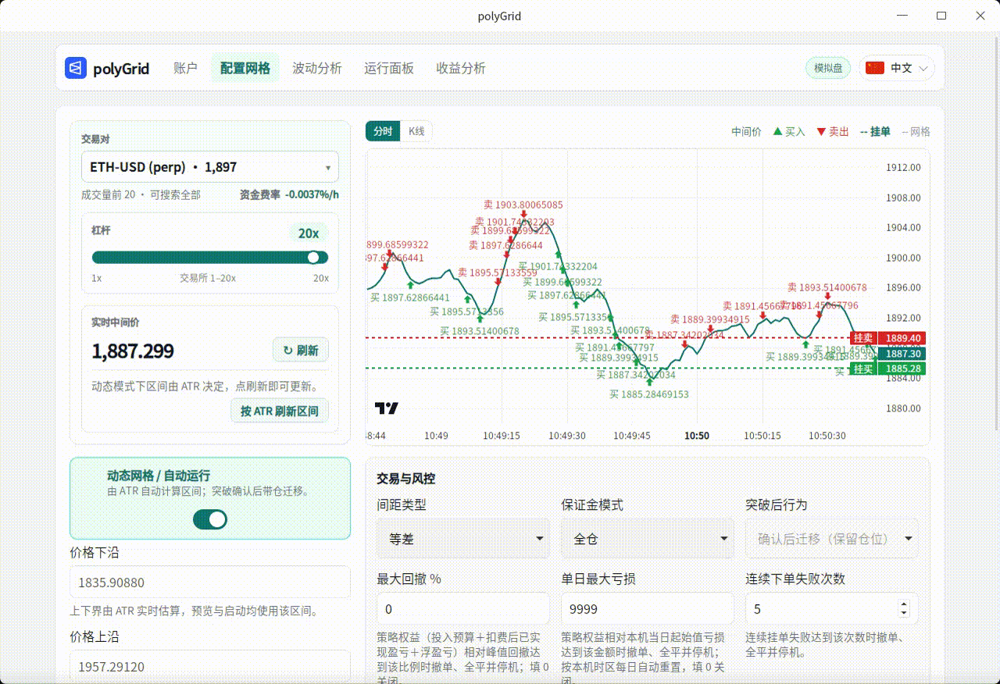

# polyGrid

[English](./README.md) | **中文**

> **永续合约需邀请才能开通** — 请先通过此链接激活：  
> **[https://polymarket.com/zh/perps?c=00kzjwdi](https://polymarket.com/zh/perps?c=00kzjwdi)**  
> 开通后把 **pUSD** 充到**永续合约账户**（预测市场账户的资金不能用于挂网格）。

> 面向 [Polymarket Perps](https://polymarket.com/zh/perps?c=00kzjwdi) 永续合约的本地网格交易桌面软件。界面支持 **中文、English、日本語、한국어、Español、Français、Deutsch、Português、Русский**，可按系统语言自动匹配，也可在右上角切换。

设定价格区间和投入后，程序会在现价下方挂买单、上方挂卖单，希望行情在区间内来回波动时赚取差价。

- **作者 Telegram**：[https://t.me/smith123_lee](https://t.me/smith123_lee) — 用着顺手也可联系了解高级版  

实盘账户如下：


## 运行演示

<p align="center">
  
</p>

> 本程序可连接真实市场与真实资金，使用前请充分理解风险。建议先用 **模拟盘** 或 **测试网** 熟悉流程。

## 基本原理

网格交易把一段价格区间分成多层「格子」。程序大致这样工作：

1. **划定区间** — 设定价格下沿、上沿、格数与总投入；也可按现价 ±5% 快速填区间。
2. **挂出网格** — 相对实时中间价，低价侧挂 **买入**、高价侧挂 **卖出**。
3. **成交补单** — 买单成交后在更高价补卖单，卖单成交后在更低价补买单，靠区间内波动反复吃差价。
4. **风控与收尾** — 可设突破行为、最大回撤、单日亏损等；**停止**时会撤销全部挂单，并以市价平掉持仓。

软件**不会**帮你充值或提现。Polymarket 有**预测市场账户**和**永续合约账户**两套资金，本软件只读永续侧余额——充到预测市场里的资金不能用来挂网格。开通方式见文首邀请链接。

## 快速开始

### 下载便携版（推荐）

不会编译代码时，请直接从 **[Releases](../../releases)** 下载预编译程序：

1. 按系统下载对应文件（无需安装包）：
   - **Windows** → `polyGrid-windows-x64.exe`（双击运行）
   - **macOS 苹果芯片** → `polyGrid-macos-arm64.app.tar.gz`（解压后打开 `.app`）
   - **macOS Intel** → `polyGrid-macos-x64.app.tar.gz`（解压后打开 `.app`）
   - **Linux** → `polyGrid-linux-x86_64.AppImage`，然后：
     ```bash
     chmod +x polyGrid-linux-x86_64.AppImage
     ./polyGrid-linux-x86_64.AppImage
     ```
2. 打开软件，建议先选 **模拟盘** 试跑。
3. 在右上角语言选择器切换界面语言（支持九种语言，默认跟随系统）。

**Linux 说明：** AppImage 在 Ubuntu 22.04 上构建，需要较新的 glibc；**Ubuntu 20.04 无法运行**桌面版。

### 从代码运行

需要先安装 [Rust](https://rustup.rs) 和 [Node.js](https://nodejs.org/)（建议 20+）。

```bash
cd apps/desktop
npm install
npm exec tauri dev    # 启动桌面程序
```

Linux 还需安装 WebKit 等系统依赖（如 `libwebkit2gtk-4.1-dev`），否则无法编译桌面端。

## 实盘前需要准备

| 项目 | 说明 |
|------|------|
| Polymarket Perps（pUSD） | 永续需邀请开通：[激活链接](https://polymarket.com/zh/perps?c=00kzjwdi)。预测市场与永续是分开账户，须把 pUSD 充到**永续合约账户**（充到预测市场无效）。 |
| 钱包私钥 | 支持 MetaMask 等钱包私钥，也支持邮箱 / Google 登录后从 [reveal.magic.link/polymarket](https://reveal.magic.link/polymarket) 导出的私钥；仅存本机 `.env`，模拟盘可不填。 |

主网启动前必须填写私钥。

## 三步上手

1. **账户** — 选择运行模式（模拟盘 / 测试网 / 主网），实盘填写私钥后点 **刷新余额**。
2. **配置网格** — 选择交易对、价格区间、格数、总投入、杠杆等 → **预览网格** → **启动**。
3. **运行面板** — 查看状态、盈亏与成交；需要时 **暂停 / 恢复 / 停止**（停止会撤单并平仓）。

也可在配置页调整间距（等差 / 等比）、保证金模式（全仓 / 逐仓）、固定 / 动态网格、突破后行为，以及最大回撤、单日亏损等风控项；支持导入 / 导出策略配置。收益分析页可查看全部会话合计与净值曲线。

## 常用配置说明

| 项目 | 说明 |
|------|------|
| 运行模式 | **模拟盘**（无真实资金）/ **测试网** / **主网** |
| 交易对 | Polymarket 永续列表（如 BTC），不做现货网格 |
| 价格下沿 / 上沿 | 网格覆盖的价格区间；动态网格下由 ATR 估算，也可刷新后覆盖 |
| 现价贴合区间 % | 「按现价 ±N%」快速填上下界（`RANGE_PCT`） |
| 网格数量 | 区间内分层层数（建议先用默认，再按习惯调整） |
| 总名义投入 | 计划投入的名义金额（pUSD）；每格过小会无法启动（约 $1/格起） |
| 间距 | 等差 / 等比 |
| 保证金模式 | 全仓 / 逐仓 |
| 杠杆 | 放大收益与风险；越高越危险 |
| 网格模式 | **动态**（默认）：按 ATR 算活动区间，突破确认后可带仓迁移；**固定**：沿用手动上下界（`GRID_MODE`） |
| ATR K 线周期 | 动态网格用的 K 线周期，默认 `1h`（`ATR_INTERVAL`） |
| ATR 周期 | ATR 计算根数，默认 14（`ATR_PERIOD`） |
| ATR 乘数 | `半宽% ≈ ATR% × 乘数`，默认 `5`，再夹到约 2%～12%（`ATR_MULT`） |
| 突破确认根数 | 连续多少根 K 线在区间外才触发迁移 / 突破动作，默认 2（`CONFIRM_BARS`） |
| 迁移冷却 / 每日最大迁移 | 动态网格 recenter 的最短间隔（默认 3600 秒）与单日上限（默认 4） |
| 突破后行为 | 固定网格：暂停 / 撤单停等；动态网格默认 **确认后迁移（保留仓位）** |
| 最大回撤 / 单日亏损 | 触发后熔断，撤单并平仓 |
| 最大连续下单失败 | 连续失败达到次数后熔断（`MAX_ORDER_FAILURES`） |
| 启动时自动开跑 | 打开程序且无可恢复会话时，按当前配置自动启动（`AUTO_START`） |
| 重启后续跑 | 有可恢复会话时自动恢复挂单与状态（`RESUME_ON_RESTART`） |
| 关闭窗口策略 | 默认 **保留** 交易所挂单与仓位（`EXIT_POLICY=preserve`）；**停止**按钮才会撤单并平仓策略标的 |

## 安全提醒

- 加密货币与永续合约存在较高风险，可能导致资金损失；杠杆越高风险越大。
- 私钥仅保存在本机，请勿发给任何人，也不要提交到网盘或聊天工具。
- 务必先用模拟盘或测试网练习；主网请从小资金开始。
- **停止**会撤单并平仓策略标的；默认关闭窗口会**保留**交易所挂单与仓位（可恢复），请留意仓位与手续费。

## 免责声明

本软件仅供学习与研究，不构成任何投资建议。使用前请自行评估风险，并遵守 Polymarket 服务条款及当地法律法规。作者不对因使用本软件造成的任何损失承担责任。

## 开源协议

MIT
